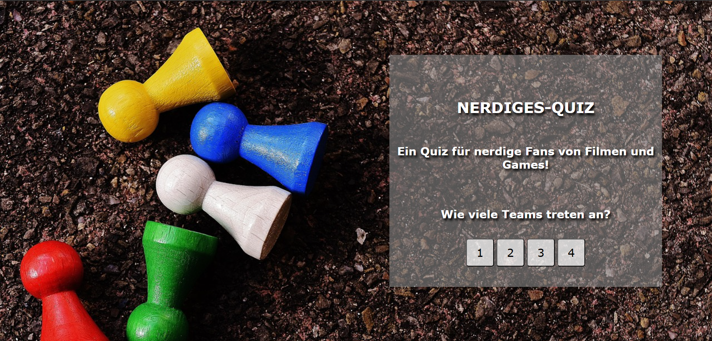
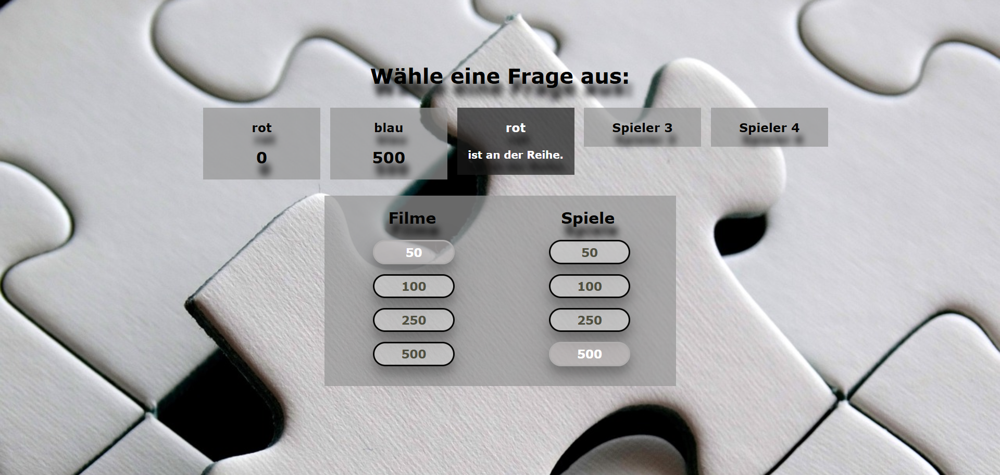
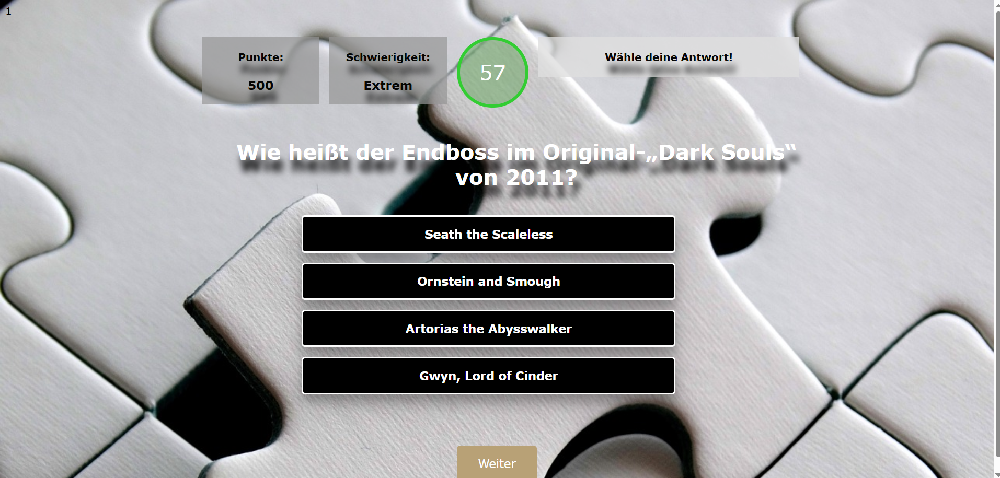
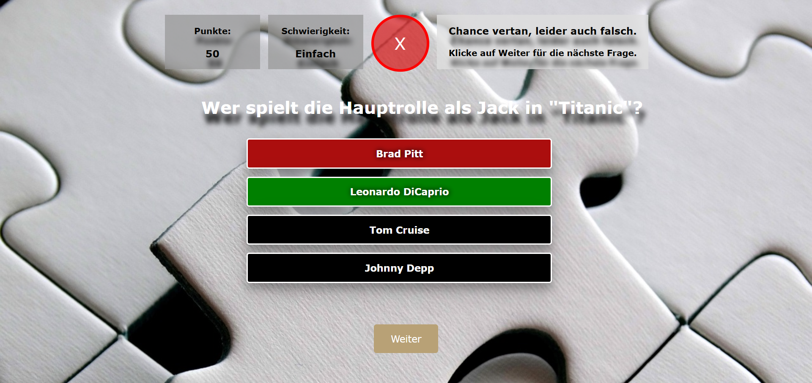

# PHP-Quiz

##Beschreibung
Ein Quiz-Programm auf PHP-Basis zum Erstellen und Spielen
eines selbst-gestalteten Quizes mit unterschiedlichen Themenbereichen.



## Was erwartet dich?
Verschiedene Themenbereiche mit Fragen in unterschiedlichen Schwierigkeitsgraden.








***

## Installation
```
git clone https://github.com/Polar-Teddy/quiz.git
```
Bei Erstinstallation zunächst die Datenbank erstellen: 
```
CREATE DATABASE IF NOT EXISTS quiztest
```
Ebenso in <b>database/db.php</b> die Datenbank-Verbindung anpassen.

Dann den <b>quiztest.sql</b> Dump einspielen, um alle Tabellen etc. zu erstellen.
Kann nach Belieben geleert und neu befüllt werden.

***

## Autorin // Projektbeginn
Chantal Jaskulla // August 2022

## Projekt Status
Testbar.
